# Item 4: OpenShift Pipelines (Tekton CI/CD) Demo

This project demonstrates deploying a s2i golang builder app

## Lessons Learned
- Knative serverless scales to zero when idle – access the Route to trigger pods.
- PipelineRuns are instances of the pipeline definition – new runs pull the latest code.
- Sandbox limits auto-triggers so manual PipelineRun start required.

## Generated Resources
Exported YAML in `generated-yaml/`:
- [pipeline.yaml](generated-yaml/pipeline.yaml)
- [pipelinerun.yaml](generated-yaml/pipelinerun.yaml)
- [knative-service.yaml](generated-yaml/knative-service.yaml)

1. In the Red Hat Developer Sandbox (https://sandbox.redhat.com/), click **+ Add** in the left navigation.
   - Select **Import from Git**.
   - **(Optional but recommended)** Fork the repo [[https://github.com/sclorg/golang-ex](https://github.com/sclorg/golang-ex)](https://github.com/sclorg/golang-ex) to your GitHub account.
   - Select **Go** for Builder Image.
   - Select **Build Using Pipelines** for Build Option. Ensure **s2i-go-knative** is selected for Pipeline.
   - Select **Serverless Deployment** for Resource Type.
   - Ensure **Create a route to the application** is checked.
   - Click **Create**.

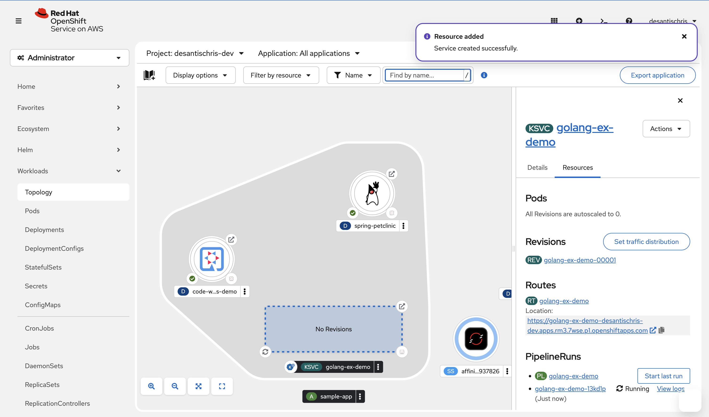

2. Topolgy view loads. Verify Resource was added and PipelineRun was initiated.

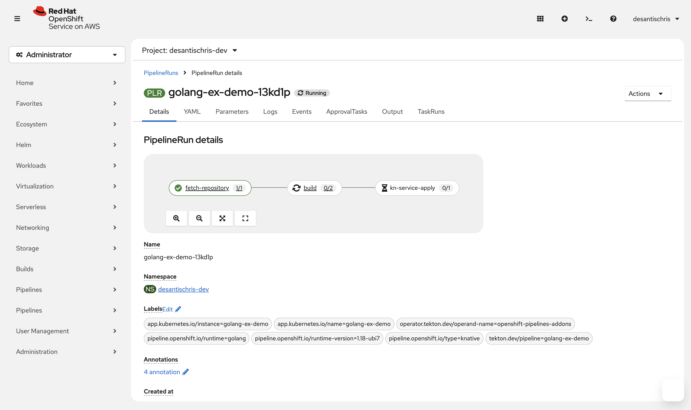

3. Observe the PipelineRun until it completes.
  - There will be two builds: one for the image, and one for the deployment

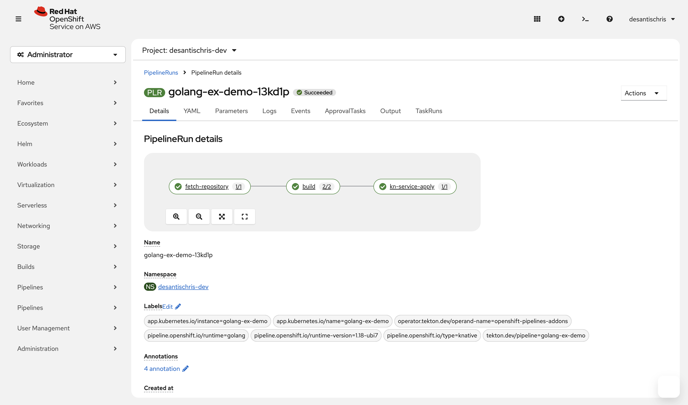

4. In the side panel for the golang resource, navigate to the **Route** section. Click the Route.
  - The route opens in a new window with a short welcome message of "Hello Openshift!"

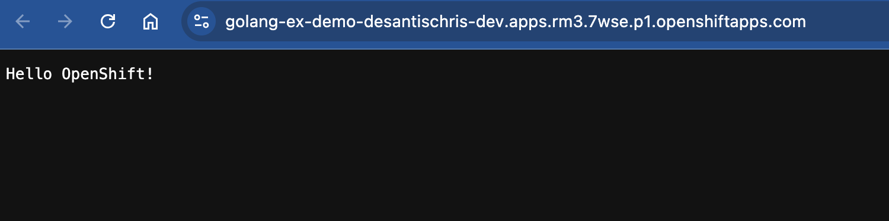

5. Close the app page. Observe the resource until the pod terminates automatically once the route is inactive for a short period of time.

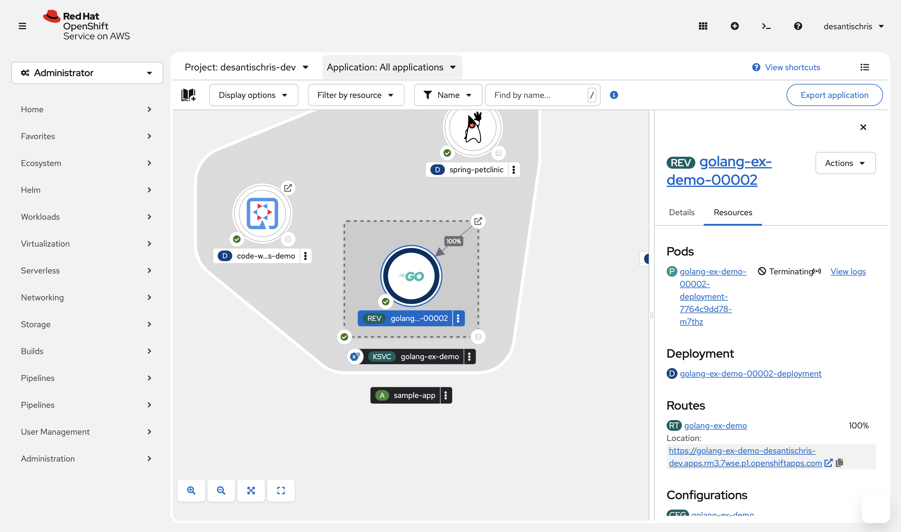

6. View the service.
  - No pods are found
  - Services are listed as autoscaling to zero.

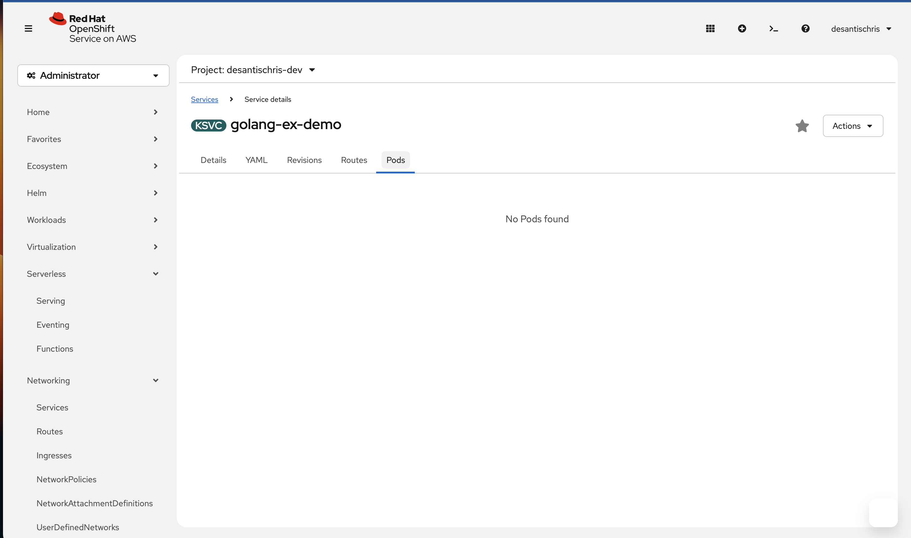

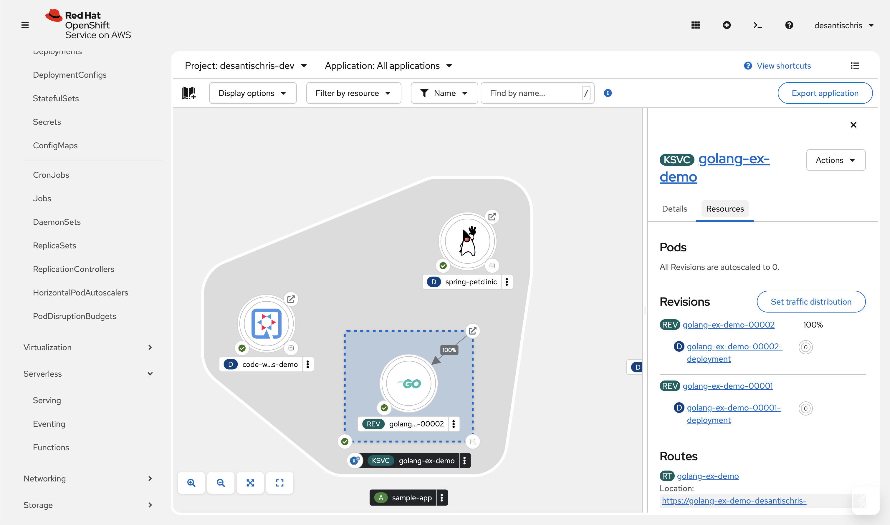

7. Click the **Route** again.
  - The route opens in a new window with the same message.
  - A pod is loaded.

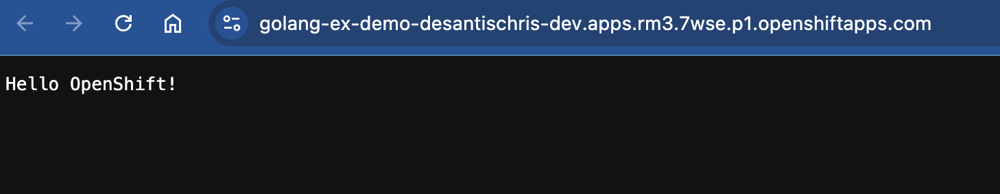

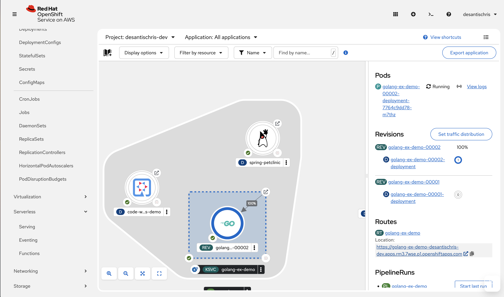

8. Modify the `hello_openshift.go` `response` varaible with a new message in the forked repo.

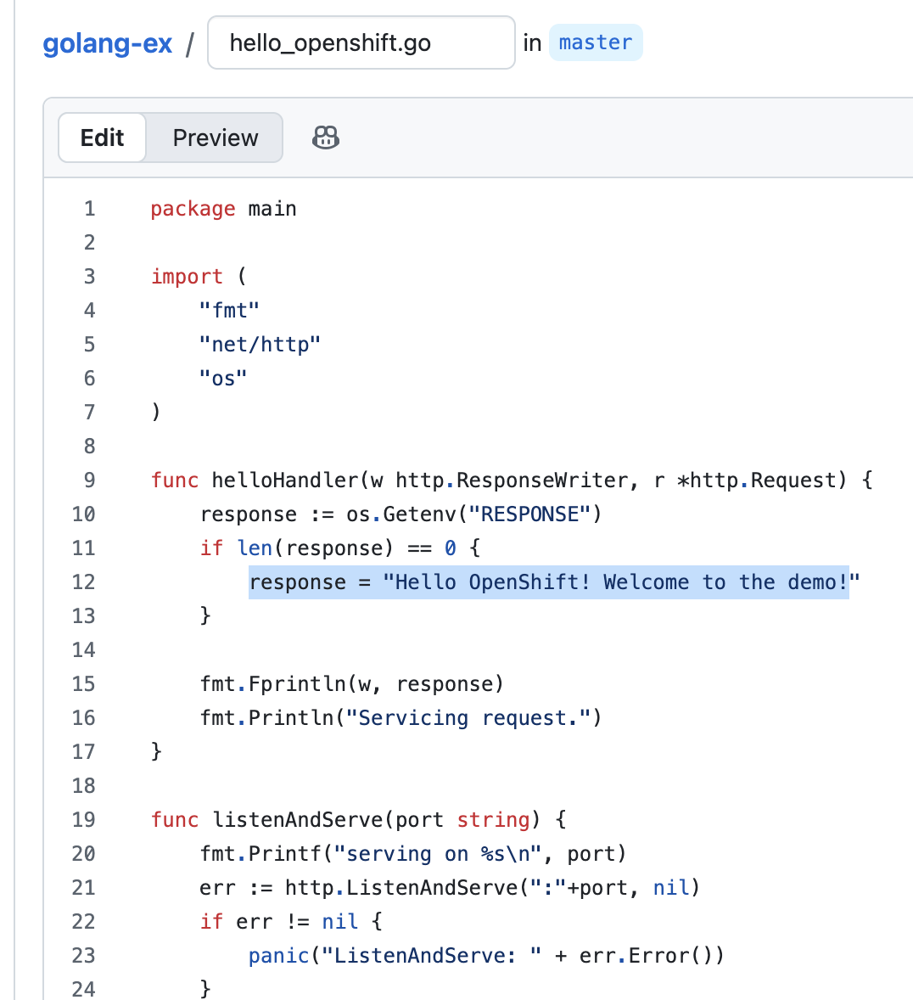

9. Navigate to the Pipeline.
- Click the three dots icon and elect **Start**.
- Verify the following parameters and click **Start**.

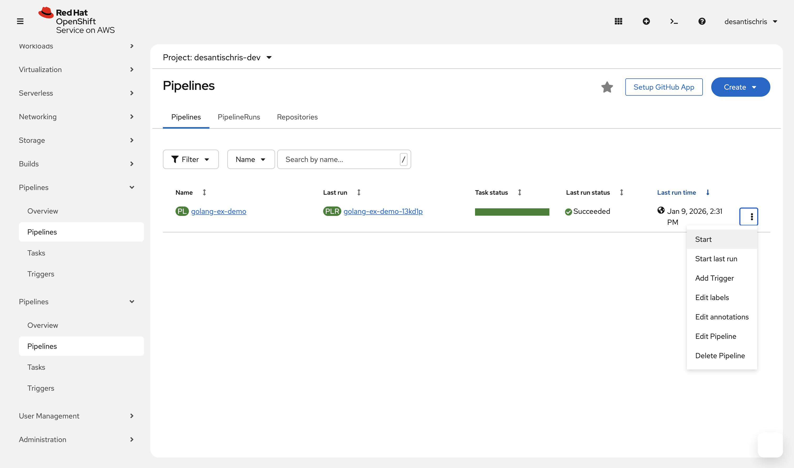

10. Navigate to PipelineRuns.
  - Observe the PipelineRun execute.

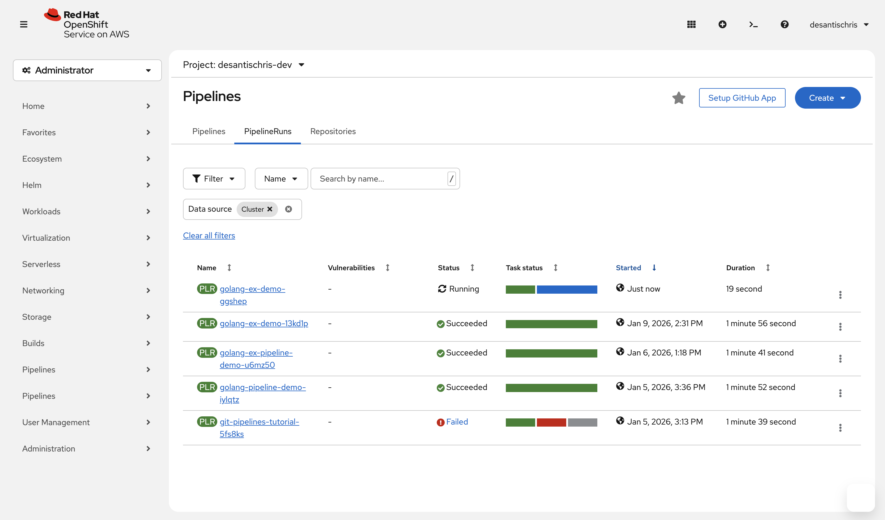

11. Once the PipelineRun has completed, open the Route.

  - Notice the message **has not** updated.

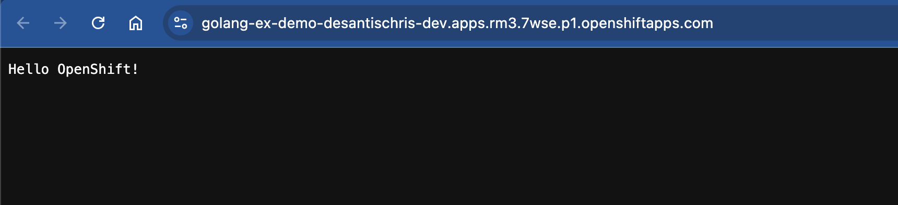

  - Reason: Knative sees no spec change in the Service, so it keeps using the existing revision which still points at the old image/digest. No new revision = no new pods with the updated text.
  - Any change under spec.template forces Knative to create a new revision.
  - Run the following patch to create a new revision:
    `
oc patch ksvc golang-ex-demo \
  --type='merge' \
  -p '{
    "spec": {
      "template": {
        "metadata": {
          "annotations": {
            "demo-revision": "text-update-1"
          }
        }
      }
    }
  }'
`

12. Repeat **Step 9** to start another pipeline run.
  - Observe the PipelineRun.
  - When it has completed, open the route again. The text is now updated.

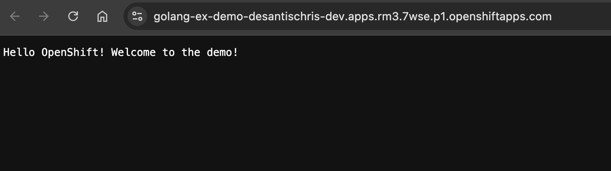
